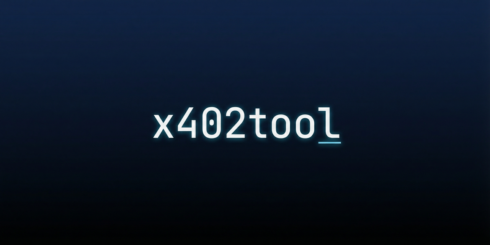

<div align="center">
  
</div>

# x402tool

[](https://www.npmjs.com/package/x402tool)
[](https://www.npmjs.com/package/x402tool)
[](https://opensource.org/licenses/MIT)

Pay for APIs with x402-protected on Solana, from the command line.

`x402tool` is like `curl` for x402 APIs. Hit any [x402-protected](https://www.x402.org/) endpoint, and the CLI handles the payment and retries automatically.

```bash
# See what it costs
x402tool GET https://jupiter.api.corbits.dev/tokens/v2/recent --dry-run

# Pay and get the response
x402tool GET https://jupiter.api.corbits.dev/tokens/v2/recent --keypair auth.json
```

## Install

```bash
npm install -g x402tool
```

Node.js v18+.

## Quick Start

**1. Preview what you'll pay** — always start here:

```bash
x402tool GET https://api.example.com/data --dry-run
```

**2. Make the request** — add your Solana keypair:

```bash
x402tool GET https://api.example.com/data --keypair ~/.config/solana/auth.json
```

That's it. The CLI detects the 402 response, submits a Solana payment, and retries with proof.

## Usage

### POST with a body

```bash
x402tool POST https://triton.api.corbits.dev \
  --keypair auth.json \
  --body '{"jsonrpc":"2.0","id":1,"method":"getBalance","params":["corzHctjX9Wtcrkfxz3Se8zdXqJYCaamWcQA7vwKF7Q"]}'
```

### Query parameters

```bash
x402tool GET "https://jupiter.api.corbits.dev/ultra/v1/order" \
  --query inputMint=So11111111111111111111111111111111111111112 \
  --query outputMint=EPjFWdd5AufqSSqeM2qN1xzybapC8G4wEGGkZwyTDt1v \
  --query amount=20000000 \
  --query taker=YOUR_WALLET_ADDRESS
```

### Save to file

```bash
x402tool GET https://api.example.com/data -o response.json
```

Path must be under the current directory.

### Agent / script mode

`--json` gives machine-readable output. `--quiet` suppresses wallet and timing logs.

```bash
x402tool GET https://api.example.com/data --dry-run --json --quiet
x402tool POST https://api.example.com/action --keypair auth.json --quiet -o result.json
```

### Timeout

Default is 30s. Override in milliseconds:

```bash
x402tool GET https://api.example.com/slow --timeout 60000
```

## Real-World Examples

These use [Corbits](https://docs.corbits.dev) x402-protected APIs.

### Jupiter — preview costs

```bash
x402tool GET "https://jupiter.api.corbits.dev/ultra/v1/order" \
  --dry-run \
  --query inputMint=So11111111111111111111111111111111111111112 \
  --query outputMint=EPjFWdd5AufqSSqeM2qN1xzybapC8G4wEGGkZwyTDt1v \
  --query amount=20000000 \
  --query taker=YOUR_WALLET_ADDRESS
```

### Jupiter — paid request

```bash
x402tool GET https://jupiter.api.corbits.dev/tokens/v2/recent \
  --keypair ~/.config/solana/auth.json
```

### Triton RPC — dry-run

```bash
x402tool POST https://triton.api.corbits.dev \
  --dry-run \
  --body '{"jsonrpc":"2.0","id":1,"method":"getBalance","params":["corzHctjX9Wtcrkfxz3Se8zdXqJYCaamWcQA7vwKF7Q"]}'
```

### Triton RPC — with payment

```bash
x402tool POST https://triton.api.corbits.dev \
  --keypair ~/.config/solana/auth.json \
  --body '{"jsonrpc":"2.0","id":1,"method":"getBalance","params":["corzHctjX9Wtcrkfxz3Se8zdXqJYCaamWcQA7vwKF7Q"]}'
```

### MetEngine — trending prediction markets

```bash
x402tool GET https://agent.metengine.xyz/api/v1/markets/trending \
  --keypair ~/.config/solana/auth.json \
  -o result.json
```

## Keypair

Standard Solana keypair format — a JSON array of numbers. Must be under cwd or home.

```bash
solana-keygen new -o my-keypair.json
```

## How It Works

1. You make a request (GET or POST).
2. If the API returns 402, the CLI parses payment requirements via `@x402/core`.
3. It signs and submits a Solana transaction with `@x402/svm`.
4. It retries the original request with the payment proof attached.

With `--dry-run`, it stops at step 2 and shows you the requirements.

The network (mainnet/devnet) is determined by the API's payment response, not by a CLI flag.

## Options

| Flag                  | What it does                         |
| --------------------- | ------------------------------------ |
| `--keypair <path>`    | Solana keypair for payment           |
| `--dry-run`           | Preview costs, don't pay             |
| `--body <json>`       | JSON body (POST only)                |
| `--query <k=v>`       | Query param (repeatable)             |
| `--rpc-url <url>`     | Solana RPC (or `SOLANA_RPC_URL` env) |
| `--json`              | Machine-readable output              |
| `--quiet`             | Suppress extra logs                  |
| `--timeout <ms>`      | Request timeout (default: 30000)     |
| `-o, --output <path>` | Write response to file               |

## Features

- Automatic Solana payment on 402 responses
- Dry-run mode to preview costs
- GET and POST with optional JSON body
- Agent-friendly JSON and quiet modes
- Configurable timeout, query params, output path
- URL scheme and keypair path validation

## Development

```bash
git clone https://github.com/pratikbuilds/x402-cli.git
cd x402-cli
npm install
npm run build
node dist/index.js GET <url>
```

## Contributing

Fork, branch, commit, push, open a PR.

## License

MIT — see [LICENSE](LICENSE).
